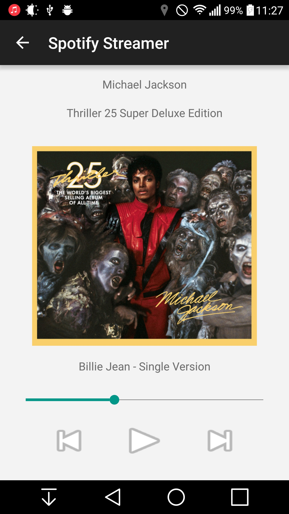
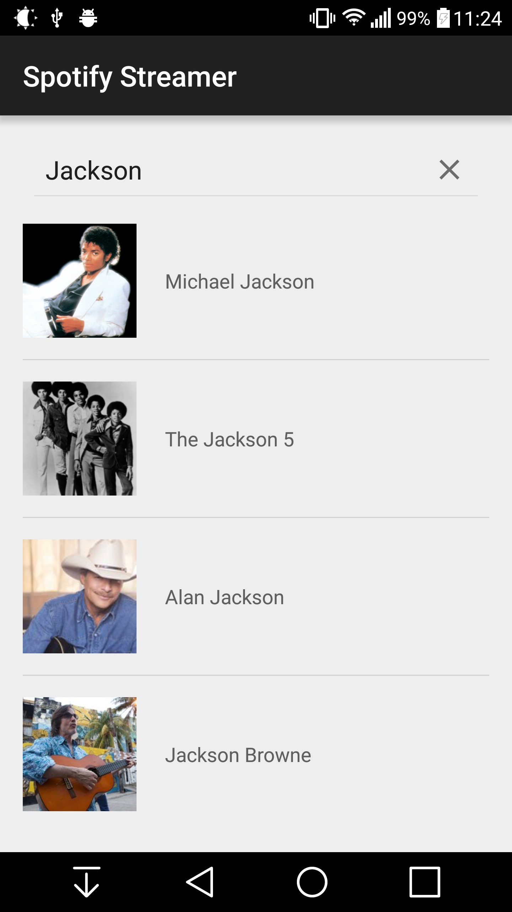
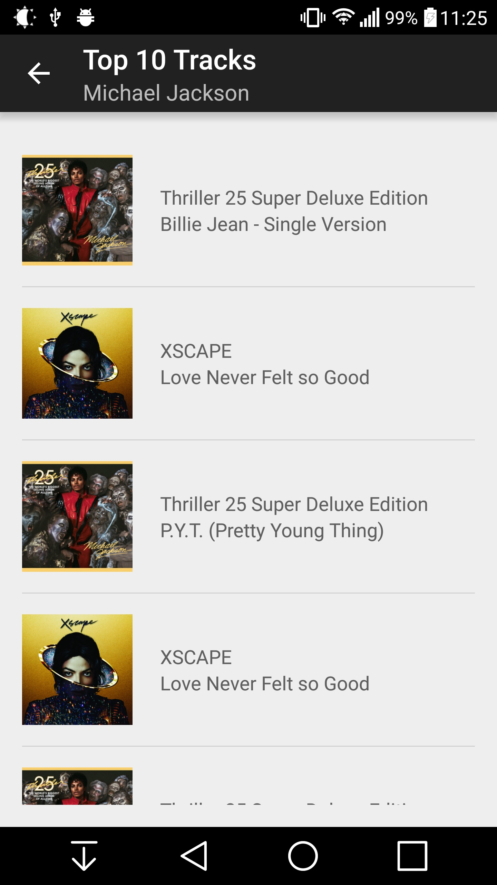
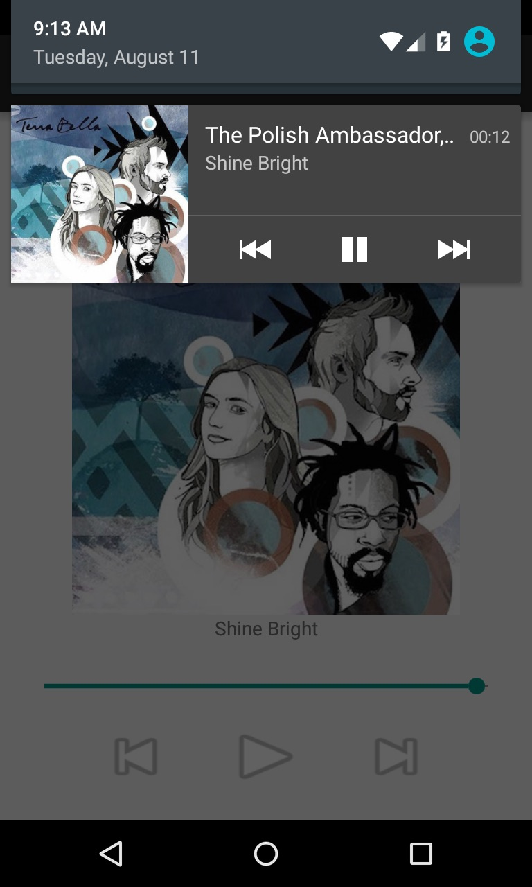
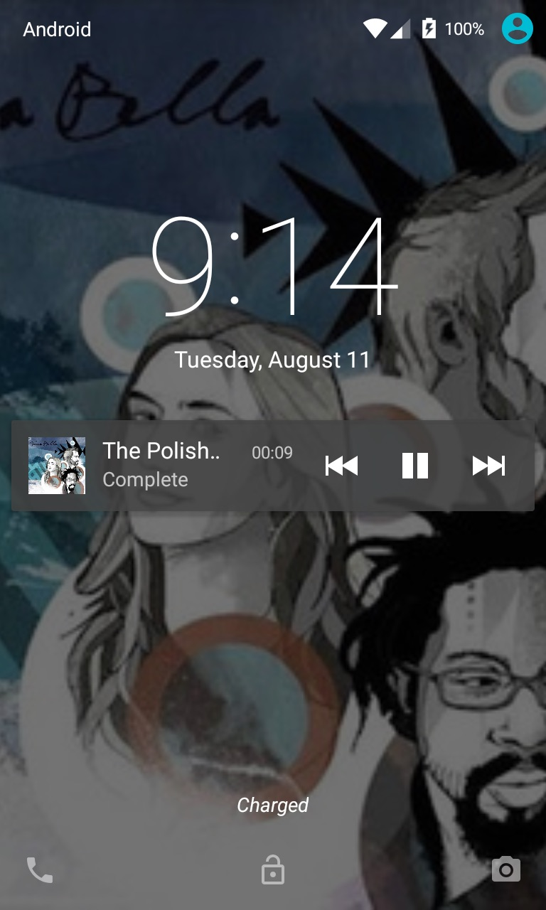
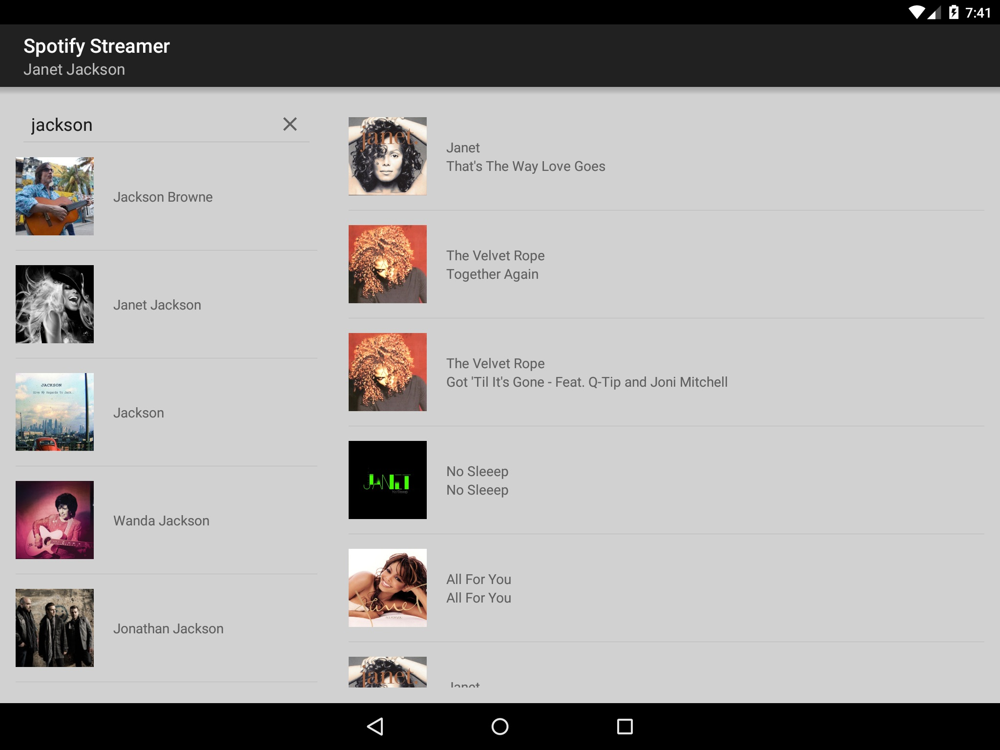
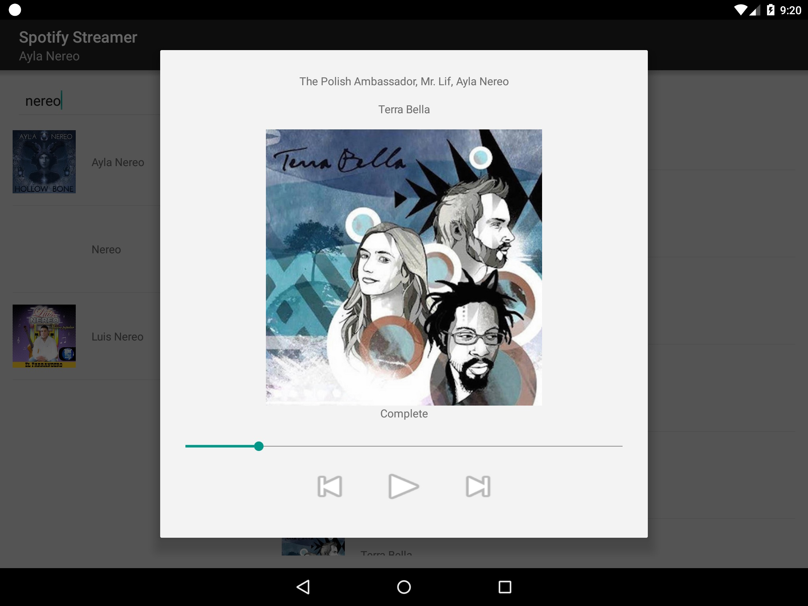

#Spotify Streamer
##Music streaming application that uses [Spotify Public API](https://developer.spotify.com/web-api/)

### Part of [Android Nanodegree](https://www.udacity.com/course/android-developer-nanodegree--nd801) project portfolio.

 

####Features
- **Search for Top10 tracks from any artist in Spotifys library**
- **Get a notification and lockscreen controls for media playback **
- **Playback is run in a service so music will play even if app is closed**
- **Alternative layout for larger screens like tablets.**

####Project description
- [Spotify Wrapper](https://github.com/kaaes/spotify-web-api-android) was used for easy API calls to Spotify API.
- [Picasso](http://square.github.io/picasso/) for loading images.
- [Greenrobot Eventbus](https://github.com/greenrobot/EventBus) for handling communication between different activites and services.

###Screenshots
####Player

 
 

####Search & Top10 Tracks
 
 
 

####Notification & Lockscreen
 
 
 

####Alternative layout for larger screens

   

